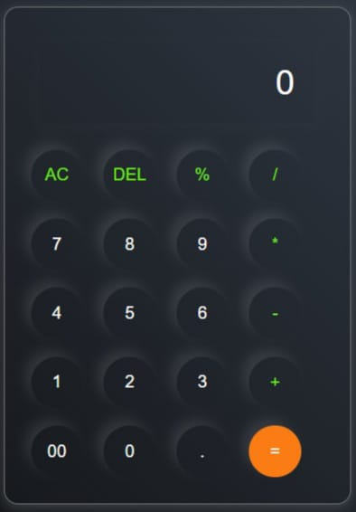

# Calculator

A responsive Calculator built using HTML, CSS, and JavaScript. It performs basic arithmetic operations with a clean and user-friendly interface.

## Technologies Used

- HTML
- CSS
- JavaScript

## Features

- Addition
- Subtraction
- Multiplication
- Division
- Responsive Design

## Preview

## Author

Saurav Zinjan
